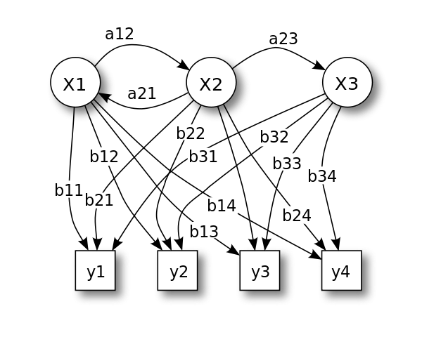

```{r setup, include=FALSE}
knitr::opts_chunk$set(echo = TRUE)
```

## Introduction to HMMs

In simple Markov models we have a set of observed states, say $X_{n}, n = 1,2,...$ with transition probabilities $p_{i \rightarrow j}$ of changing from state $i$ to state $j$. But what if the states are not directly observed? We might run into a situation where we directly observe the outputs of a process that are probabilistically determined depending on which state the process is in, but we don't directly observe the states. **Hidden Markov Models** become applicable in this scenario.

Below is a graphical representation:

<center>


**Figure 1.** Probabilistic parameters of a hidden Markov model (example)  
X — states  
y — possible observations  
a — state transition probabilities  
b — output probabilities  
</center>

An example of a hidden Markov process is a generalization of the Urn problem without replacement. Imagine a room of urns $X_{1}$, $X_{2}$, $X_{3}$ each with a mixture of different balls labeled $y_{1}$, $y_{2}$, $y_{3}$. There's someone inside the room choosing balls from the urn and showing you only the labelled balls, but not the urn from which they came. Additionally, assume there is some probabilistic process of choosing which urn to sample from, that the choice of the next urn only depends directly on the urn that was chosen before it, and that you know the relative proportions of different balls within each urn. This process meets the criteria for a hidden markov process.

A biologically relevant example of where HMMs are used is in genome sequence annotation. For example, in gene prediction, you have some prior information about what a gene looks like, hidden states that represent whether you have a gene or not, a probability of moving between non-protein coding and protein-coding sequence, and a set of observations that are the sequences themselves.

## Lecture Notes

HMMs model an underlying sequence of observations. These observations are emitted by hidden states.

We are interested in the following random variables:

$Q = (Q_{1}, ..., Q_{N})$, $O = (O_{1}, ..., O_{K})$, $A = (a_{ij}, i = 1, ..., N, j=1, ..., N)$, and $\pi = (pi_{i}, ..., \pi_{N})$ where $Q$ are the hidden states, $O$ are the potential observations, $A$ are state transition probabilities, and $\pi$ are the prior probabilities or weights.

While these are necessary for defining the hidden layer of the hidden markov model, we still need to define emission probabilities. That is, the probability that we get a certain output based on being in a certain state at time $t$. We define these as:

$$
B = {b_{ij}, i=1, ..., N, j=1, ..., K}
$$

Say $\lambda = (A,B,\pi)$

In order to impliment an HMM we must first solve the following problems:

1. We need to compuate the liklehood, $L(\lambda) = P(O|\lambda)$
2. We need to compute the maximum likelihood estimate for $\lambda$, $\widehat{\lambda} = \underset{\lambda}{argmax} P(O|\lambda)$
3. Finally, we need to compute the maximum likelihood estimate of $Q$, $\widehat{Q} = \underset{Q}{argmax} P(Q|O,\lambda)$

Four well known algorithms can be used to solve these problems:

1. Forward algorithm
2. Backward algorithm
3. Virterbi algorithm (example of dynamic programming)
4. Baum-Welch algorithm (example of an EM algorithm)

### Calculating the likelihood

We want the marginal distribution of $O$ to calculate: 


$$
\begin{align*}
P(O|\lambda) &= \sum_{Q} P(O,Q|\lambda) \\
             &= \sum_{Q} P(Q_{1})P(O_{1}|Q_{1})P(Q_{2}|Q_{2})P(O_{2}|Q_{2})...P(O_{T}|Q_{T}) \\
             &= \sum_{Q} q \pi_{q_{1}} b_{q_{1}}(O_{1}) a_{q_{1}q_{2}} b_{q_{2}}(O_{2}) a_{q_{2}q_{3}} b_{q_{3}}(O_{3}) a_{q_{3}q_{4}}... b_{q_{T}}(O_{T})
\end{align*}
$$

For this naive summation we would have $N^{T}$ terms. However, if we distribute the sums similar to Feselstein's pruning algorithm for calculating the likelihoods of phylogenetic trees, we can reduce the number of terms.


#### Forward algorithm

1. Initialize (N steps)

$\alpha_{1}(i) = \pi_{i} b_{i}(O_{1})$  

Then you get $\sum_{q_{1}} \alpha(q_{1}) a_{q_{1}q_{2}}$ because there are no other $q_{1}$s  

2. Compute $\alpha_{t}(i)$ recursively for $t = 1 ... T$ ($TN^{2}$ steps)  

$\alpha_{t}(i) = \sum_{j} \alpha_{t-1}(j) a_{ji} b_{i}(O_{t})$  

$\sum_{q_{1}} \alpha_{1}(q_{1}) a_{q_{1}q_{2}} b_{q_{2}}(O_{2})$  

$\sum_{q_{3}...q_{T}} \sum_{q_{2}} \alpha_{2}(q_{2}) a_{q_{2}q_{3}} b_{q_{3}}(O_{3}) a_{q_{3}q_{4}} ... b_{q_{T}}(O_{T})$   

$\alpha_{t}(i) = P(O_{1}...O_{T}, Q_{t} = i)$  

3. Calculate $\sum_{i} \alpha_{T}(i) = P(O|\lambda)$ (N steps)

Now the computation is approximately on the order of $TN^{2}$


#### Backward algorithm

Perform the forward algorithm in reverse

1. $B_{T}(j) = 1, j= 1, ..., N$
2. $B_{t}(j) = \sum_{i} a_{ji} b_{i}(O_{t}) B_{t+1}(i)$

$\alpha_{t}(i) = P(O_{1} ... O_{T}, Q_{t}|\lambda)$
$B_{t}(i) = P(O_{t+1}, ... O_{T}|Q_{t} = i|\lambda)$

If we are interested if a particular region of the genome is "open", $P(Q_{t} = i|O_{i}, \lambda) = \frac{P(O_{t}, Q_{t}=i|\lambda)}{P(O|\lambda)}$ where the numerator is the product of $\alpha_{t}(i)$ and $B_{t}(i)$ and the denominator is $\sum_{i} \alpha_{t}(i) B_{t}(i)$

So how do we calculate $\underset{Q}{argmax} P(Q|O,\lambda)$?

$\underset{Q}{argmax} P(Q|O,\lambda) = argmax \pi_{q_{1}} b_{q_{1}}(O_{1}) a_{q_{1}q_{2}} b_{q_{2}}(O_{2}) a_{q_{2}q_{3}} b_{q_{3}}(O_{3}) ... b_{q_{T}}(O_{T})$

Break this up into subproblems...successive set of maximization problems. Now we have T different maximizations.

$\delta_{1}(q_{2}) = max q_{1} \pi_{q_{1}} b_{q_{1}}(O_{1}) a_{q_{1}q_{2}}$
$\delta_{2}(q_{3}) = max q_{2} \delta_{q_{1}}(q_{2}) b_{q_{2}}(O_{2}) q_{q_{2}q_{3}}$
.
.
.
$delta_{T}(q_{T})$

Again, we get an algorithm with complexity of $TN^{2}$

Lattice model is a different way of visualizing a markov chain.

#### Baum-Welch algorithm

Example of an EM algorithm.

$\theta^{t+1} = argmax E_{z|x} [log P(X,Z|\theta)]$

Here we have

$\lambda^{t+1} = argmax E_{Q|O}[\lambda^{t}]log P(O,Q|\lambda)$

$\sum_{Q} log P(O,Q|\lambda) P(Q|O,\lambda^{t})$

$\sum log(\pi_{i})I_{Q}=i + \sum log(a_{ij}) \cdot \# t_{ij}(Q) + \sum log(b_{ik}) \cdot \# O_{ij}(Q) P(Q|O,\lambda^{t})$

Where $\# t_{ij}(Q)$ = number of transitions from i to j in path Q.

$\sum_{i,j} E[\# t_{ij}(Q)|\lambda^{t},O] log(a_{ij}) + \sum_{i,j} E[\# O_{ij}(Q)|\lambda^{t},O] log(b_{ij}(j)) + \sum P(Q=i|lambda^{t}, O) log(\pi_{i})$

\begin{align*}
$$
\begin{align*}
a_{ij}^{t+1} &= \frac{E[\# t_{ij}(Q)|\lambda^{t},O]}{E[\# of times in state i|\lambda^{t},O]} \\
b_{ij}^{t+1} &= \frac{E[\# O_{ij}(Q)|\lambda^{t},O]}{E[\# times in state i|\lambda^{t},O]} \\
pi_{i}^{t+1} &= P(Q_{i}=1|\lambda^{t},O) \\
end{align*}
$$

## Helpful links

1. [Rabiner Tutorial](http://www.ece.ucsb.edu/Faculty/Rabiner/ece259/Reprints/tutorial%20on%20hmm%20and%20applications.pdf) 
2. [Wikipedia article on HMMs](https://en.wikipedia.org/wiki/Hidden_Markov_model)
3. [Nature Biotechnology Primer on HMMs](http://www.nature.com/nbt/journal/v22/n10/full/nbt1004-1315.html)
